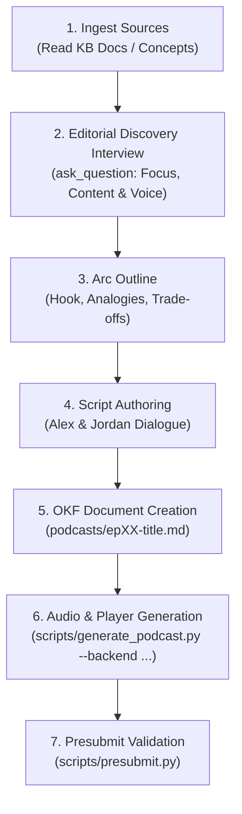

# Create a Podcast & Audio Overview (`/create-podcast`)

## Overview

The **Create a Podcast** skill equips AI agents to transform dense technical architecture, external regulatory realities, and product proposals into engaging, two-host audio deep dives—identical in tone, banter, and intellectual depth to **Google NotebookLM Audio Overviews**.

Rather than outputting dry bulleted summaries, this skill produces authentic conversational dialogues where two hosts actively discuss, debate, unpack analogies, and dissect technical trade-offs. It produces both a structured Markdown episode transcript (stored under `/podcasts/`) and an interactive HTML5 audio player with dual-voice speech synthesis.

---

## 1. When to Use This Skill

Activate this skill whenever:
* The user asks to **"create a podcast"**, **"generate an audio overview"**, **"turn this into a conversation like NotebookLM"**, or **"make an audio deep dive"**.
* Synthesizing complex architectural decisions (e.g. `/systems/core-architecture.md`) or concept clusters for executive leadership, cross-functional partners, or engineering onboarding.
* Creating audio-first artifacts that team members can listen to during commutes, walking meetings, or screen-free focus time.
* Exploring contentious architectural trade-offs (e.g. event-driven vs. request-response, SQLite vs. Postgres, federated vs. centralized) through a spirited host debate.

---

## 2. Host Persona & Conversational Architecture

NotebookLM's signature magic comes from the dynamic chemistry between two distinct, passionate host personas:

### Host 1: **Alex** (The Synthesizer & Inquisitive Guide)
* **Voice / Energy**: Engaging, curious, upbeat, and quick to spot the overarching narrative.
* **Role**:
  - Sets the stage and frames the core question or problem.
  - Crafts vivid, relatable real-world analogies (e.g., comparing distributed transactions to restaurant kitchen order tickets).
  - Poses the questions that the listener is wondering.
  - Keeps conversational momentum flowing and bridges topics smoothly.

### Host 2: **Jordan** (The Deep Diver & Technical Realist)
* **Voice / Energy**: Analytical, thoughtful, grounded in code and operational reality.
* **Role**:
  - Unpacks the "under the hood" invariants, schemas, and algorithms.
  - Highlights the pragmatic catch—edge cases, failure modes, latency penalties, and regulatory boundaries.
  - Gently pushes back on oversimplifications with authentic developer realism.
  - Brings historical context or architectural trade-off analysis.

### Conversational Dynamics & Banter Guidelines
1. **Natural Turn-Taking & Interruptions**:
   - Hosts don't give speeches; they converse. One host might build on the other's sentence (`"Right, and that's exactly why..."`) or interrupt with an epiphany (`"Wait, so you're saying that if the token expires..."`).
2. **Authentic Vocal Cues**:
   - Annotate lines with natural stage directions: `[enthusiastic]`, `[chuckles]`, `[thoughtful pause]`, `[leaning in]`, `[intrigued]`, `[nodding]`, `[skeptical]`.
3. **The Power of Analogies**:
   - Every episode must feature at least one memorable, illuminating real-world analogy to anchor complex engineering concepts.
4. **No Generic Robot Praise**:
   - Never write `"That is an excellent point, Jordan!"` Instead, write: `"Oh, 100%. Because the moment you drop network connectivity, that entire assumption goes out the window."`

---

## 3. Four Episode Formats

| Format | Target Duration | Word Count | Ideal For |
| :--- | :--- | :--- | :--- |
| **Deep Dive (Default)** | 8–15 minutes | 1,200–2,000 words | Comprehensive exploration of systems, clusters, or strategic shifts. |
| **Executive Brief** | 3–5 minutes | 500–800 words | High-energy synthesis of a single RFC, incident review, or milestone. |
| **Debate & Devil's Advocate** | 8–12 minutes | 1,200–1,600 words | Evaluating two architectural alternatives, risks, or frontier proposals. |
| **Foundational Explainer** | 8–10 minutes | 1,000–1,500 words | Team onboarding and demystifying domain jargon for non-specialists. |

---

## 4. Voice Synthesis Backends

The podcast skill supports five distinct voice synthesis options:

| Backend | Engine | Key Features | Requirements |
| :--- | :--- | :--- | :--- |
| **`google`** | **Google Cloud / Gemini Neural TTS** | Ultra-high-fidelity Google Journey & Neural2 conversational voices. Matches Google NotebookLM studio tone. | `GOOGLE_API_KEY` (or in `.env`) |
| **`edge`** | **Microsoft Edge Neural TTS** | Hyper-realistic dual-host neural voices (`Ava` & `Andrew`). | Free, zero API key (`pip install edge-tts`) |
| **`elevenlabs`** | **ElevenLabs Studio Voices** | Industry-standard studio voice cloning and character voices (`Rachel` & `Adam`). | `ELEVENLABS_API_KEY` (or in `.env`) |
| **`macos`** | **macOS Native Speech** | High-quality offline dual voices (`Samantha` & `Daniel`) with natural 350ms conversational pauses. | macOS built-in (`say` + `afconvert`), 100% offline |
| **`web`** | **Interactive Web Player Only** | Standalone HTML5 player using browser Web Speech API (`window.speechSynthesis`), real-time karaoke highlight. | Zero dependencies, works in any browser |

---

## 5. Pre-Production Editorial Discovery & Scoping Interview

Before authoring an episode script or generating audio, the AI agent **must initiate an interactive editorial interview** using the `ask_question` tool (unless the user has already specified all parameters in their prompt).

This ensures the generated podcast is tailored precisely to the user's intended focus, depth, audience, and voice preference:

### Mandatory Interview Questions:

1. **Narrative Focus & Editorial Angle**:
   * *Question*: "What is the primary narrative focus and angle of this episode?"
   * *Options*:
     * `(Recommended) Architectural & Technical Deep Dive (Invariants, data contracts, failure modes, trade-offs)`
     * `Executive & Strategic Summary (Business value, ecosystem impact, timeline, high-level mechanics)`
     * `Spirited Architectural Debate (Weighing pros vs. cons of competing architectural choices)`
     * `Newcomer Educational Explainer (Demystifying concepts with intuitive real-world analogies for onboarding)`

2. **Content Scope & Emphasis**:
   * *Question*: "Which specific aspects or themes should the hosts spend the most time unpacking?"
   * *Options*:
     * `(Recommended) System boundaries, ingress authentication, and background worker queues`
     * `Data persistence, storage invariants, and cache invalidation trade-offs`
     * `Resilience, graceful degradation, and error recovery patterns`
     * `Comprehensive balanced overview covering all sections of the source document equally`

3. **Target Audience & Technical Depth**:
   * *Question*: "Who is the primary target audience and desired technical depth?"
   * *Options*:
     * `(Recommended) Core Software Engineers & Architects (High technical depth, code and contract specifics)`
     * `Cross-Functional Team (Product managers, designers, operations leads)`
     * `Executive Leadership & Strategic Stakeholders (Strategic decisions, risks, roadmaps)`

4. **Voice Synthesis Engine**:
   * *Question*: "Which voice synthesis engine would you like to use for the audio overview?"
   * *Options*:
     * `(Recommended) Microsoft Edge Neural TTS (Free, high-fidelity neural voices Ava & Andrew, zero rate limits)`
     * `Google Cloud / Gemini Neural TTS (Requires GOOGLE_API_KEY with available quota)`
     * `ElevenLabs Studio Voices (Requires ELEVENLABS_API_KEY)`
     * `macOS Native System Voices (Offline, Samantha & Daniel)`
     * `Interactive Web Player Only (In-browser Web Speech API)`

---

## 6. Slash Commands & Invocation

### Chat Slash Command
```text
/create-podcast systems/core-architecture.md
/create-podcast "Explain our data residency model and how it impacts European users" --format deep-dive
/create-podcast concepts/cluster-agentic-execution.md --backend edge
```

### CLI Tool
Developers can also synthesize audio and generate web players directly from the terminal. If `--backend` is omitted, the CLI presents an interactive selection menu:
```bash
# Interactive selection menu (prompts for engine and API key if needed)
python3 scripts/generate_podcast.py podcasts/ep01-core-architecture.md

# Direct backend specification
python3 scripts/generate_podcast.py podcasts/ep01-core-architecture.md --backend edge
python3 scripts/generate_podcast.py podcasts/ep01-core-architecture.md --backend google
python3 scripts/generate_podcast.py podcasts/ep01-core-architecture.md --backend macos
python3 scripts/generate_podcast.py podcasts/ep01-core-architecture.md --backend web

# Open interactive player in default browser
python3 scripts/generate_podcast.py podcasts/ep01-core-architecture.md --open
```

---

## 7. End-to-End Production Workflow

When an agent executes `/create-podcast`, follow this 7-step lifecycle:



### Step 1: Ingest Sources
* Read the target markdown files in `/systems/`, `/concepts/`, `/ecosystem/`, or `/frontier/`.
* Extract the technical boundaries, schemas, and core trade-offs.

### Step 2: Conduct Editorial Discovery Interview
* Ask the user via `ask_question` to choose the narrative angle, content emphasis, target audience, and preferred voice engine.

### Step 3: Outline the Narrative Arc
* Incorporate the user's chosen emphasis:
  * **The Hook (0:00–1:30)**: Start in media res. Why is this topic fascinating, surprising, or urgent?
  * **The Anchor Analogy (1:30–4:00)**: Introduce the relatable mental model tailored to the target audience.
  * **Under the Hood (4:00–7:30)**: Unpack the specific components highlighted by the user.
  * **The Catch / Pragmatic Friction (7:30–10:30)**: Where does it break? Address trade-offs and edge cases.
  * **Horizon & Closing Synthesis (10:30–12:00)**: Strategic takeaways aligned with the focus angle.

### Step 4: Author the Episode Script
* Use the standardized template located at `templates/podcast-template.md`.
* Ensure frontmatter declares `type: Podcast Episode`, metadata specifies `Narrative Focus` and `Target Audience`, and links source documents in `sources:`.

### Step 5: Write Episode to `podcasts/`
* Name file following the convention: `podcasts/epXX-<kebab-case-topic>.md`.
* Example: `podcasts/ep01-core-architecture-deep-dive.md`.

### Step 6: Synthesize Player & Audio
* Execute `python3 scripts/generate_podcast.py podcasts/<file>.md --backend <choice>`.
* Verify that the interactive HTML player `podcasts/<file>.html` is generated and linked to the audio track.

### Step 7: Presubmit Conformance
* Run `./scripts/presubmit.py`.
* Ensure 0 errors, 0 warnings, and that `index.md` registers the new episode.

---

## 8. Verification Checklist

Before reporting completion to the user, ensure:
- [ ] Frontmatter contains valid OKF v0.2 metadata (`type: Podcast Episode`, `title`, `description`, `sources`).
- [ ] Both hosts (Alex & Jordan) participate with distinct personalities and authentic conversational rhythm.
- [ ] At least one concrete real-world analogy is woven into the dialogue.
- [ ] The dialogue includes timestamps (`[00:00]`) and stage directions (`[curious]`, `[laughing]`).
- [ ] Interactive HTML player is created and verified.
- [ ] `./scripts/presubmit.py` passes with 0 errors.
