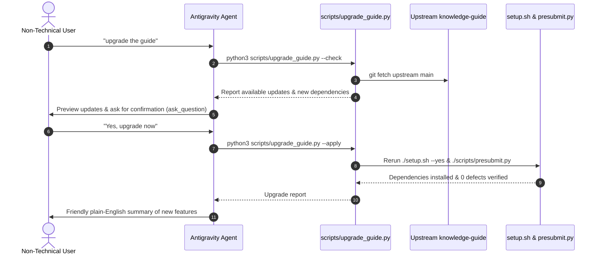

# Upgrade Knowledge Guide (Upstream Software Sync)

This skill allows **non-technical users** and **AI agents** to upgrade the knowledge base software, tooling, skills, and dependencies from the upstream `knowledge-guide` repository without needing to know anything about Git or GitHub.

---

## 1. When to Use This Skill

Activate this skill whenever a user says:
* **"upgrade the guide"**
* **"upgrade version"**
* **"update system"**
* **"update guide"**
* **"check for updates"**
* **"get the latest changes from upstream"**
* Slash command: `/upgrade-guide`

---

## 2. Interaction Contract & Workflow

This skill strictly enforces an **interactive confirmation flow** designed for non-technical users:



---

## 3. Step-by-Step Execution Protocol

### Step 1: Check for Updates & Preview
When the user mentions upgrading, **do not immediately mutate the workspace**. First, check what updates are available:

```bash
python3 scripts/upgrade_guide.py --check --json
```

1. If `updates_available` is `false`:
   * Inform the user warmly: *"Your knowledge base software is already fully up to date with the latest upstream release! No update is needed."*
   * Stop here.
2. If `updates_available` is `true`:
   * Extract the commit count, key new capabilities (e.g. YouTube video ingestion, new skills, updated validator), and any new dependencies (e.g. `youtube-transcript-api`).
   * Proceed to Step 2.

---

### Step 2: Request Confirmation
Ask the user for explicit confirmation before proceeding.

* Use the `ask_question` tool with clear, simple language:
  * **Question**: *"New updates are available for your knowledge base software! Would you like to get the latest updates now?"*
  * **Options**:
    * `"(Recommended) Yes, upgrade the knowledge base software now"`
    * `"No, keep my current version for now"`
* Along with the question, show a brief bulleted preview in conversational text explaining:
  * Number of new upstream updates available.
  * Key improvements or new skills included.
  * Any new optional libraries that will be installed.

---

### Step 3: Execute the Upgrade
If the user selects **Yes**, execute the upgrade engine:

```bash
python3 scripts/upgrade_guide.py --apply
```

The engine automatically:
1. **Protects In-Progress Work**: Safely stashes any uncommitted local changes (`git stash push -u`) so nothing is ever lost.
2. **Maintains Git Ancestry**: Merges upstream updates using `-s ort -X ours`, preserving local custom configurations (`knowledge.config.json`) and organization-specific documents (`ecosystem/`, `systems/`, `concepts/`).
3. **Pulls New Software & Skills**: Updates core scripts (`scripts/*.py`), skills (`skills/**`), templates (`templates/*`), and configurations.
4. **Installs New Dependencies**: Executes `./setup.sh --yes` to install any new requirements (e.g. `youtube-transcript-api` via pip/uv).
5. **Re-validates Knowledge Base**: Executes `./scripts/presubmit.py` to auto-repair any links, regenerate `index.md`, compile graph data for the viewer, and confirm 0 errors.
6. **Restores In-Progress Work**: Pops any stashed local modifications (`git stash pop`) back into place.
7. **Logs the Upgrade**: Appends a verifiable audit entry to `log.md`.

---

### Step 4: Inspect & Verify
Review the command output to ensure:
* `setup.sh` completed successfully and installed dependencies.
* `scripts/presubmit.py` passed with 0 errors.
* Script permissions are executable (`chmod +x scripts/*.py setup.sh`).

---

### Step 5: Deliver a Friendly, Plain-English Summary
Present a clear, celebratory summary to the user. **Avoid confusing Git terminology** (like remotes, fast-forwards, or detached HEADs). Instead, focus on **what they can now do**:

Example response:
> ✨ **Knowledge Guide Upgraded Successfully!**
> 
> Your knowledge base software has been updated to the latest version. Here is what was updated:
> 
> * **🎬 YouTube Transcript Ingestion**: You can now say `ingest <youtube-url>` or use `/ingest` to automatically pull transcripts and metadata from YouTube videos directly into your knowledge base.
> * **⚙️ Dependency Auto-Installation**: The setup script installed `youtube-transcript-api` so new capabilities are immediately active.
> * **🔍 Improved Validator & Indexing**: The background indexing engine now supports advanced command-line options.
> * **🛡️ Verification**: The self-test presubmit gatekeeper ran and confirmed 0 errors. All your local notes and settings were safely preserved!

---

## 4. Safety & Non-Technical Guarantees

1. **Zero Git Knowledge Required**: Non-technical users never need to touch a terminal, run git commands, or know what a branch is.
2. **Local Customization Protection**: `knowledge.config.json`, custom concept clusters, and organization files are never overwritten by upstream defaults.
3. **Zero Data Loss**: Uncommitted drafts and local notes are automatically preserved and restored.
4. **Self-Healing Presubmit**: The repository's presubmit gatekeeper runs as part of the upgrade to ensure the knowledge graph remains healthy and unbroken.

---

## 5. Maintenance Scripts

* **Upgrade Script**: [`scripts/upgrade_guide.py`](file:///scripts/upgrade_guide.py) - Standalone Python tool for checking and applying upstream updates.
* **Environment Setup**: [`setup.sh`](file:///setup.sh) - Installs dependencies and configures system permissions.
* **Presubmit Gatekeeper**: [`scripts/presubmit.py`](file:///scripts/presubmit.py) - Validates bundle integrity and compiles graph viewer.
